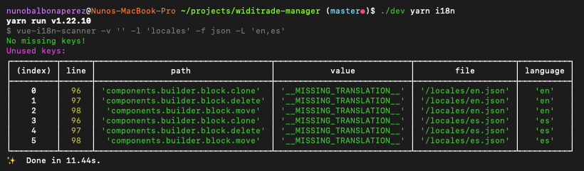

<h1 align="center">vue-i18n-scanner</h1>

Translation string analyzer that reports missing and unused keys

                                                                                       
---

`vue-i18n-scanner` is built to work with your Vue.js projects using [vue-i18n](https://kazupon.github.io/vue-i18n/). When run `vue-18n-scanner` analyses your Vue.js source code for any `vue-i18n` key usages (ex. $t(''), $tc(''), ...) as well as your language files (ex. de_DE.js, en_EN.json, ...), in order to:

- Report keys that are missing in the language files.
- Report unused keys in the language files.
- Add missing keys to language files

It is built to support both .js and .vue files, and tested and on active use on large codebases

## Example

Check the example by running `npm run example`. You can base your package.json `i18n` script on that one, or run it directly like: 

`npx vue-i18n-scanner -v 'src' -l 'locales' -f json -L 'en,es'`

## Configuration
`vue-i18n-scanner` is highly opinionated, and doesn't offer configuration besides the CLI options. Run `npx vue-i18n-scanner report --help` to learn more

## License

[MIT](http://opensource.org/licenses/MIT)
